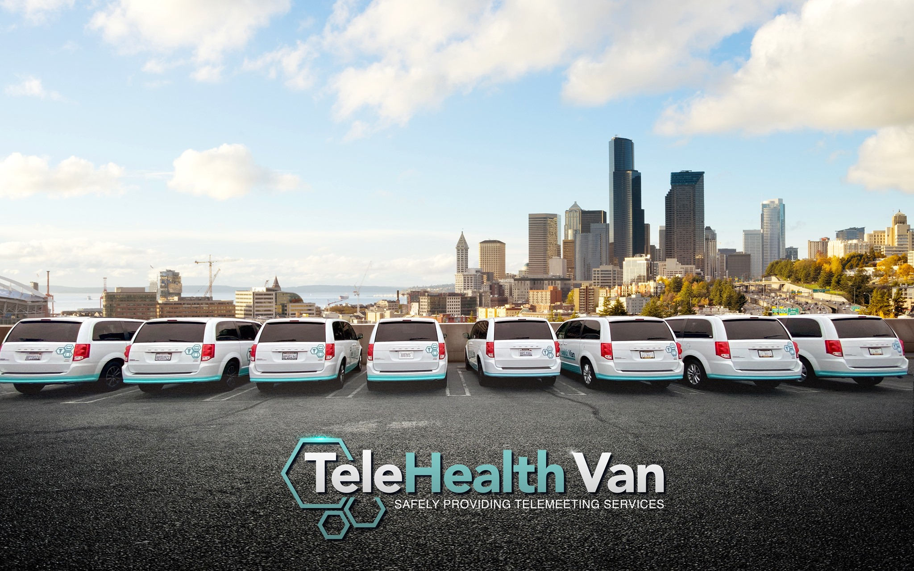

# TeleHealth Van Network

The nation's largest 5G-enabled mobile telehealth fleet providing **free, anonymous mental health therapy** for everyone.



## About

TeleHealth Van Network delivers free, grant-funded mental health care through mobile telehealth vans and remote therapy sessions. Licensed therapists. No insurance required. No one turned away.

### Key Differentiators
- **100% Free** - All services funded by grants and partnerships
- **100% Anonymous** - No personal data required
- **Licensed Therapists** - Professional mental health care
- **Mobile Fleet** - Nation's largest 5G-enabled telehealth van network

## Tech Stack

- **Framework:** Next.js 16 (App Router)
- **Language:** TypeScript
- **Styling:** Tailwind CSS v4
- **Animations:** Framer Motion
- **Fonts:** Playfair Display (headings), Inter (body)
- **Icons:** Lucide React

## Getting Started

### Prerequisites
- Node.js 18+
- npm or yarn

### Installation

```bash
# Clone the repository
git clone https://github.com/dion-sketch/telehealth-van-network.git
cd telehealth-van-network

# Install dependencies
npm install

# Run development server
npm run dev
```

Open [http://localhost:3000](http://localhost:3000) to view the site.

### Build

```bash
# Build for production
npm run build

# Start production server
npm start
```

## Project Structure

```
telehealth-van/
├── src/
│   ├── app/                    # Next.js App Router pages
│   │   ├── layout.tsx          # Root layout
│   │   ├── page.tsx            # Home page
│   │   ├── programs/           # Programs page
│   │   ├── impact/             # Impact & Recognition
│   │   ├── fleet/              # Our Fleet
│   │   ├── partner/            # Partner With Us
│   │   ├── support/            # Get Support
│   │   ├── faq/                # FAQ
│   │   ├── privacy/            # Privacy Policy
│   │   ├── terms/              # Terms of Service
│   │   └── accessibility/      # Accessibility Statement
│   ├── components/
│   │   ├── layout/             # Header, Footer
│   │   ├── sections/           # Page sections
│   │   └── ui/                 # Reusable UI components
│   └── lib/
│       └── data.ts             # Content and data
├── public/
│   ├── images/                 # Logos, photos, assets
│   └── videos/                 # Video assets
└── package.json
```

## Features

### Creative Hero Section
- Modern gradient backgrounds with animated mesh orbs
- Grid pattern overlay for depth
- Glassmorphism effects on UI elements
- Smooth Framer Motion animations
- Reusable `HeroBackground` component for consistent styling across all pages

### Video Integration
- Auto-playing hero video with controls
- Program-specific videos for Hawthorne Cares and Pull Up Mental Health Concert
- Local video hosting in `/public/videos/`

### Responsive Design
- Mobile-first approach
- Optimized for all screen sizes
- Touch-friendly navigation

## Pages

| Route | Page | Description |
|-------|------|-------------|
| `/` | Home | Hero with video, stats, programs overview, partners, fleet gallery |
| `/programs` | Programs | All 6 programs with detailed descriptions and videos |
| `/impact` | Impact | Metrics, awards, media coverage, testimonials |
| `/fleet` | Fleet | Van information, locations, how it works |
| `/partner` | Partner | Partnership opportunities, contact form |
| `/support` | Support | Access care, crisis resources, contact form |
| `/faq` | FAQ | Searchable FAQ with category tabs |
| `/privacy` | Privacy | Privacy Policy |
| `/terms` | Terms | Terms of Service |
| `/accessibility` | Accessibility | Accessibility Statement |

## Programs

1. **Mobile Telehealth Van** - Flagship 5G-enabled fleet serving communities
2. **Student Wellness Program** - University partnerships across the country
3. **Hawthorne Cares** - First city-wide mental health program in the nation (with video)
4. **Wellness Helpline for Afghans** - USCRI partnership for refugee support
5. **Pull Up Mental Health Concert** - Annual event with Grammy-winning artists (with video)
6. **Jewish Student Mental Health** - Ruderman Foundation funded program in Boston

## Impact

| Metric | Value |
|--------|-------|
| Therapy Sessions Delivered | 30,000+ |
| Students at Pull Up Concert | 9,000 |
| Cost to Clients | $0 |
| Fleet Status | #1 Largest 5G-Enabled Nationwide |

## Partners

- LA County Department of Mental Health
- City of Hawthorne
- Ruderman Family Foundation
- Behavioral Health Services (BHS)
- U.S. Committee for Refugees and Immigrants (USCRI)
- 4Hunnid Wayz Foundation
- American Indian Changing Spirits (AICS)

## Design System

### Colors

| Name | Value | Usage |
|------|-------|-------|
| Navy | `#0c1f35` | Primary dark, backgrounds |
| Navy Light | `#163456` | Secondary dark |
| Teal | `#0d9488` | Primary accent, CTAs |
| Teal Light | `#14b8a6` | Hover states |
| Teal Pale | `#ccfbf1` | Light backgrounds |
| Gold | `#d4a853` | Secondary accent |

### Typography

- **Display Font:** Playfair Display (serif)
- **Body Font:** Inter (sans-serif)

### Components

- `HeroBackground` - Reusable gradient background with animated orbs
- `Header` - Sticky navigation with mobile menu
- `Footer` - Multi-column footer with newsletter signup
- `Button` - Styled button component with variants

## Scripts

```bash
npm run dev      # Start development server
npm run build    # Build for production
npm run start    # Start production server
npm run lint     # Run ESLint
```

## Videos

Videos are stored in `/public/videos/`:
- `hero-overview.mp4` - Main overview video for the hero section

External videos (from telehealthvan.com):
- Hawthorne Cares overview
- Pull Up Mental Health Concert overview

## License

Private - TeleHealth Van Network

---

Built with Next.js and Tailwind CSS
